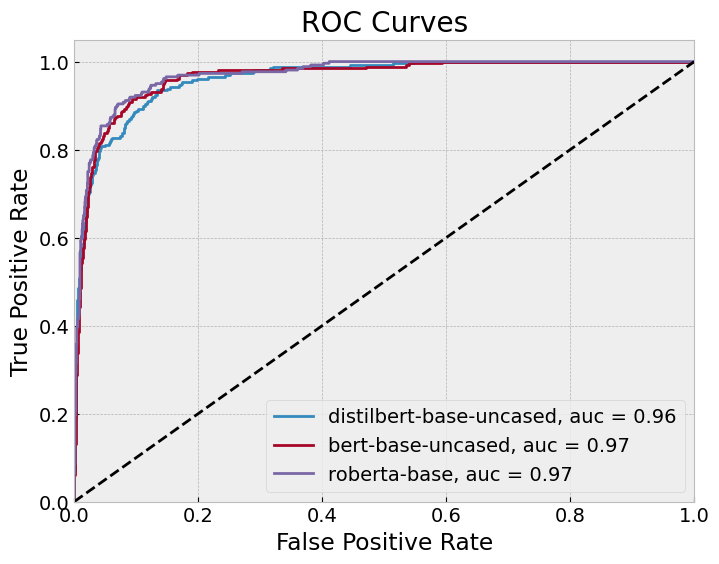
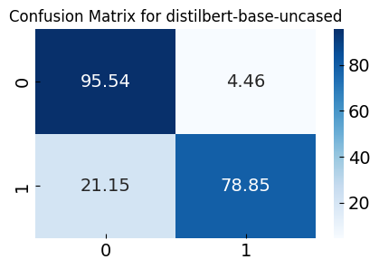
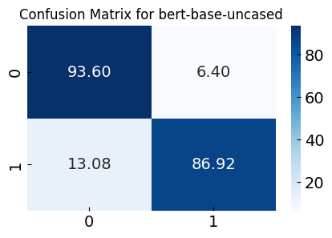
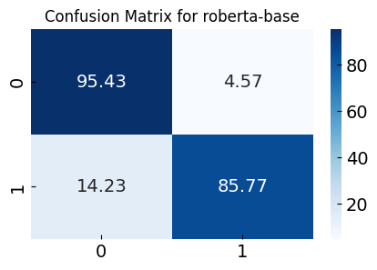
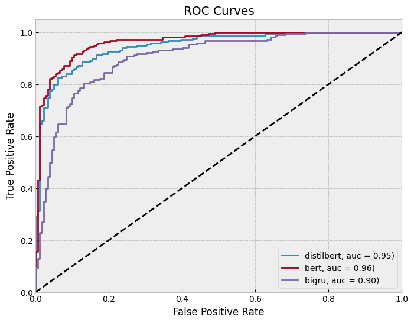
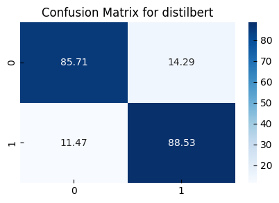
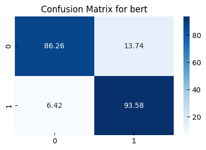
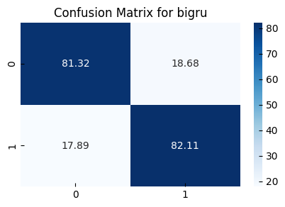

CU Boulder MSDS course work 
DTSA 5798 Supervised Text Classification for Marketing Analytics 

## Topic Detection using k-Train

Contextual advertising is an important aspect of digital advertising. This allows advertisers to advertise on web pages that match specific types of content.

This dataset contains around 200k news headlines from the year 2012 to 2018 obtained from [HuffpPost](https://www.huffpost.com). Each news headline has a corresponding category, totaling 41 categories.

The task is to detect the categories "WELLNESS" and "HEALTHY LIVING", which together account for about 12.2% of the total dataset.

 

### Reduced Reviews

randomly sample 5% from the dataset

| Model                   | Precision (0) | Recall (0) | F1-Score (0) | Support (0) | Precision (1) | Recall (1) | F1-Score (1) | Support (1) | Accuracy | Macro Avg Precision | Macro Avg Recall | Macro Avg F1-Score | Weighted Avg Precision | Weighted Avg Recall | Weighted Avg F1-Score |
|-------------------------|---------------|------------|--------------|-------------|---------------|------------|--------------|-------------|----------|----------------------|-------------------|---------------------|------------------------|---------------------|----------------------|
| distilbert-base-uncased | 0.97          | 0.96       | 0.96         | 1749        | 0.72          | 0.79       | 0.76         | 260         | 0.93     | 0.85                 | 0.87              | 0.86                | 0.94                   | 0.93                | 0.93                 |
| bert-base-uncased       | 0.98          | 0.94       | 0.96         | 1749        | 0.67          | 0.87       | 0.76         | 260         | 0.93     | 0.82                 | 0.90              | 0.86                | 0.94                   | 0.93                | 0.93                 |
| roberta-base            | 0.98          | 0.95       | 0.97         | 1749        | 0.74          | 0.86       | 0.79         | 260         | 0.94     | 0.86                 | 0.91              | 0.88                | 0.95                   | 0.94                | 0.94                 |

 
  

| | | |
| --- | --- | --- |
| | | |

 

### Balanced Reviews

randomly sample 2000 samples from each category

| Model    | Precision (0) | Recall (0) | F1-Score (0) | Support (0) | Precision (1) | Recall (1) | F1-Score (1) | Support (1) | Accuracy | Macro Avg Precision | Macro Avg Recall | Macro Avg F1-Score | Weighted Avg Precision | Weighted Avg Recall | Weighted Avg F1-Score |
|----------|---------------|------------|--------------|-------------|---------------|------------|--------------|-------------|----------|----------------------|-------------------|---------------------|------------------------|---------------------|----------------------|
| distilbert | 0.86          | 0.86       | 0.86         | 182         | 0.88          | 0.89       | 0.88         | 218         | 0.87     | 0.87                 | 0.87              | 0.87                | 0.87                   | 0.87                | 0.87                 |
| bert     | 0.92          | 0.86       | 0.89         | 182         | 0.89          | 0.94       | 0.91         | 218         | 0.90     | 0.90                 | 0.90              | 0.90                | 0.90                   | 0.90                | 0.90                 |
| bigru    | 0.79          | 0.81       | 0.80         | 182         | 0.84          | 0.82       | 0.83         | 218         | 0.82     | 0.82                 | 0.82              | 0.82                | 0.82                   | 0.82                | 0.82                 |

 
  

||||
|---|---|---|
||||

  

data from [News Category Dataset](https://www.kaggle.com/datasets/rmisra/news-category-dataset), [huffpost](https://www.huffpost.com) 
notebook from [repo](https://github.com/elfchildRichter/dtsa5798_topic_detection_k_train) 
